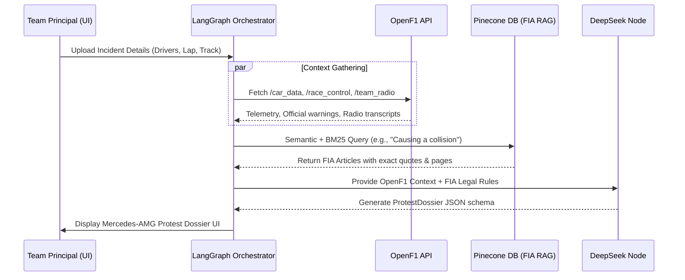
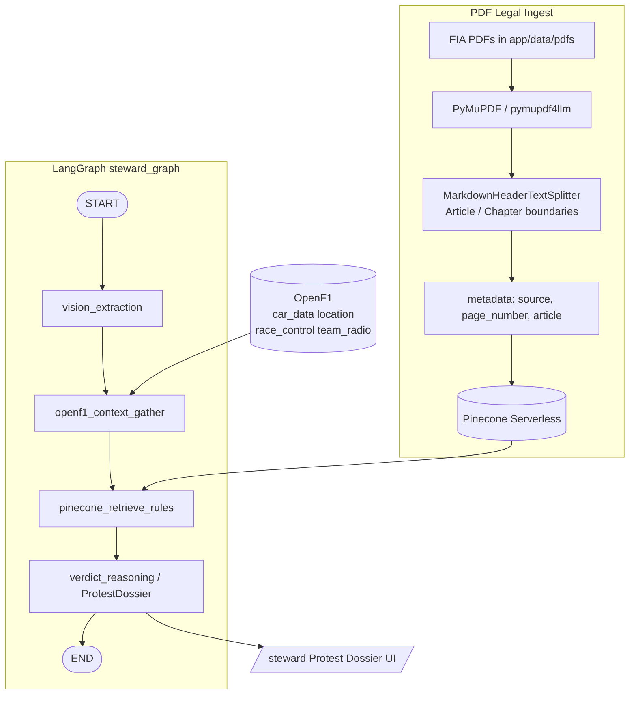

# Architecture — Team Principal Protest & Review Engine

Contract aligned with [README.md](./README.md) and [IMPLEMENTATION_PLAN.md](./IMPLEMENTATION_PLAN.md).

**Product north star (Phase 1 active):** a **Team Principal Protest & Review Engine**. The user acts as counsel for a constructor (e.g. Mercedes-AMG Petronas), ingests an on-track incident, gathers OpenF1 session context, retrieves **verbatim FIA Sporting Regulations** from a legal RAG index, and receives a structured **Protest Dossier** — not a fake Steward Decision.

**Secondary product surface (shipped):** the Apex Analytics commercial desk (constructor economics, driver ROI, LangGraph Co-Pilot). That desk remains separate from the Protest graph.

**Disclaimer:** dossier output is a **portfolio simulation**. Citations must quote the indexed regulation text and page metadata; they are not an official FIA filing.

---

## 1. System context — Protest Engine

```
┌──────────────────────────┐   /api/steward/*    ┌─────────────────────────────┐
│ Next.js /steward         │ ◄─────────────────► │ FastAPI                     │
│ Mercedes Protest Dossier │                     │ LangGraph steward_graph     │
│ Evidence checklist UI    │                     │  vision → context → RAG →   │
└──────────────────────────┘                     │  dossier counsel (DeepSeek) │
                                                 └──────┬──────────┬───────────┘
                    ┌────────────────────────────────────┘          │
                    ▼                                               ▼
           ┌─────────────────┐                            ┌──────────────────┐
           │ OpenF1 v1       │                            │ Pinecone         │
           │ /car_data       │                            │ (Serverless)     │
           │ /location       │                            │ FIA PDF chunks   │
           │ /race_control   │                            │ + page metadata  │
           │ /team_radio     │                            └────────▲─────────┘
           │ /sessions /laps │                                     │
           └─────────────────┘                            ┌────────┴─────────┐
                                                          │ PDF ingest job   │
                                                          │ PyMuPDF → MD     │
                                                          │ Header splitter  │
                                                          │ backend/app/     │
                                                          │ data/pdfs/*.pdf  │
                                                          └──────────────────┘
```

| Concern | Choice |
| --- | --- |
| Legal corpus | Official FIA PDFs under `backend/app/data/pdfs/` |
| PDF extract | **PyMuPDF** (`fitz`), optionally `pymupdf4llm` → Markdown |
| Legal chunking | LangChain **`MarkdownHeaderTextSplitter`** (and/or recursive split on `Article` / `Chapter`) — **not** fixed-size character windows |
| Vector store | **Pinecone Serverless (Free Tier)** |
| Chunk metadata | `{"source": "filename.pdf", "page_number": int, "article": "string"}` |
| Reasoning model | `deepseek/deepseek-r1` via OpenRouter |
| Vision (optional) | `qwen/qwen2.5-vl-72b-instruct` via OpenRouter (frames from MP4) |
| Context APIs | OpenF1: telemetry + **`/race_control`** + **`/team_radio`** |

Frontend never calls OpenF1 or Pinecone directly. OpenF1 client rules unchanged: TTL cache, ~3 req/s, **404 → `[]`**, never `session_key=latest`, live 401 → `F1_LIVE_LOCK` / graceful degrade on the Protest path.

---

## 2. Sequence — Phase 1 dossier generation



---

## 3. Pipeline architecture — ingest & graph



---

## 4. PDF ingestion & legal chunking

1. Place official regulation PDFs in `backend/app/data/pdfs/`.
2. Extract text **per page** with PyMuPDF so `page_number` is never lost.
3. Convert page text (or full-doc Markdown via `pymupdf4llm`) and split with **`MarkdownHeaderTextSplitter`** and/or recursive separators such as `\nArticle`, `\nChapter`, `\nAppendix` so clauses are not bisected mid-sentence.
4. Upsert into Pinecone with dense embeddings; enable hybrid retrieval (**semantic + BM25**) for article-number and keyword queries.
5. Every vector must carry:

```json
{
  "source": "FIA_2026_F1_Sporting_Regulations_Iss08.pdf",
  "page_number": 42,
  "article": "Article 14"
}
```

**Strict citation rule for the counsel node:** when emitting `regulatory_violations`, use the **exact verbatim quote** from the retrieved chunk text and copy `page_number` / `source` from chunk metadata. Do not paraphrase rule text.

---

## 5. OpenF1 context gathering (before reasoning)

After vision / live-feed enrichment resolves `session_key` and involved drivers, the graph gathers:

| Resource | Purpose |
| --- | --- |
| `/v1/car_data` | Speed, brake, throttle (coarse public samples) |
| `/v1/location` | Spatial path samples |
| `/v1/laps` | Lap time window bounds |
| `/v1/race_control` | Official messages, flags, investigated / noted incidents |
| `/v1/team_radio` | Driver ↔ pit audio metadata / transcripts when available |

Whole-lap or low-Hz OpenF1 data is **not** treated as proof of understeer or contact. When evidence is coarse, the dossier sets `success_probability: Low` and lists **Phase 2** micro-telemetry requirements (steering angle, brake at apex, throttle delta, T-Cam sync).

---

## 6. Protest Dossier contract

Primary response field: `protest_dossier` on `POST /api/steward/analyze_clip` (+ `/upload`, `/stream`).

```ts
type RegulatoryCitation = {
  article_name: string;
  exact_quote: string;      // verbatim from RAG chunk
  page_number: number;      // from chunk metadata
  source_document: string;  // from chunk metadata.source
};

type ProtestDossier = {
  filing_type: "protest" | "right_of_review";
  filing_team: string;
  competitor_team: string;
  primary_claim: string;
  regulatory_violations: RegulatoryCitation[];
  available_evidence_summary: string;
  required_telemetry_evidence: {
    id: string;
    label: string;
    rationale: string;
    status: "present" | "pending_phase2" | "insufficient";
    phase2_schema_ref: string;
  }[];
  success_probability: "Low" | "Medium" | "High";
  legal_risk_notes: string;
  recommended_next_step: string;
  phase2_bridge: string;
};
```

Legacy `verdict` summary fields may remain for compatibility; the UI renders the dossier.

Phase 2 (future): `POST /api/steward/phase2/telemetry` accepts 10–100 Hz channels to satisfy `pending_phase2` items.

---

## 7. Commercial desk (existing, unchanged topology)

The Apex Analytics dashboard + chat Co-Pilot remain the business console:

- Dashboard GET joins OpenF1 championship DTOs with the commercial **fact store** (Supabase / SQLite). No live search on page load.
- LangGraph chat: Generalist → Data Analyst / Researcher ⇄ tools → Technical Manager.
- `F1_LIVE_LOCK` on live-session OpenF1 401 for dashboard routes.

Protest Engine and commercial chat use **separate compiled graphs**.

---

## 8. Frontend surfaces

| Route | Role |
| --- | --- |
| `/season/{year}` … | Commercial desk |
| `/steward` | Team Principal Protest Dossier — intake, coarse OpenF1 traces, pipeline lights (Ingest → OpenF1 → ISC RAG → Dossier), evidence checklist badges |

---

## 9. Environment

| Variable | Purpose |
| --- | --- |
| `OPENROUTER_API_KEY` | Vision + DeepSeek counsel |
| `STEWARD_VISION_MODEL` / `STEWARD_REASON_MODEL` | Defaults Qwen-VL / DeepSeek-R1 |
| `PINECONE_API_KEY` | Pinecone Serverless |
| `PINECONE_INDEX` | FIA regulations index name |
| `PINECONE_NAMESPACE` | Optional namespace (e.g. `fia-sporting-2026`) |
| `OPENF1_*` | Same as commercial desk |

Local fallback during CI: keyword / Chroma teaching corpus when Pinecone keys are absent — production Protest path targets Pinecone + official PDFs.
