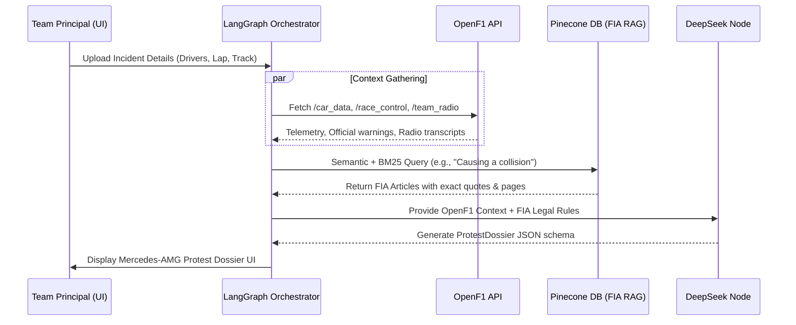

# Architecture — Apex F1 Suite

Contract aligned with [README.md](./README.md), [FEATURES.md](./FEATURES.md), and [IMPLEMENTATION_PLAN.md](./IMPLEMENTATION_PLAN.md).

**Product north star (Regulatory Desk):** a **Team Principal Protest & Review Engine**. The operator acts as counsel for a constructor (e.g. Mercedes-AMG Petronas), ingests an on-track incident, gathers OpenF1 session context, retrieves **verbatim FIA Sporting Regulations** from a legal RAG index, and receives a structured **Protest Dossier** — not a fake Steward Decision.

**Disclaimer:** dossier output is a **portfolio simulation**. Citations must quote the indexed regulation text and page metadata; they are not an official FIA filing.

**Commercial desk (shipped):** Apex Analytics — Manufacturer ROI, Driver Assets, Executive Co-Pilot. Separate compiled LangGraph from the Protest Engine. Feature inventory: [FEATURES.md](./FEATURES.md).

---

## Shipped protest phases (1–3)

| Phase | Name | Status | Delivers |
| --- | --- | --- | --- |
| **Phase 1** | **Pinecone RAG Setup & PDF Ingestion** | **Done** | `backend/scripts/ingest_pdfs.py` (PyMuPDF) → `MarkdownHeaderTextSplitter` → Pinecone upsert with `page_number` + `source_document` metadata |
| **Phase 2** | **LangGraph Updates (OpenF1 & Reasoning)** | **Done** | OpenF1 `/v1/race_control` + `/v1/team_radio` tools; `verdict_reasoning_node` emits **exact verbatim** quotes + page/source; `ProtestDossier` with `required_telemetry_evidence` when OpenF1 is coarse |
| **Phase 3** | **Next.js Protest Dossier UI** | **Done** | `/steward` Mercedes-AMG Petronas FIA Protest Dossier — RegulatoryCitation cards + evidence checklist badges |

**Naming note:** Evidence status `pending_phase2` on a dossier item means *future high-frequency telemetry ingest*, **not** Implementation Phase 2 (LangGraph). See [IMPLEMENTATION_PLAN.md](./IMPLEMENTATION_PLAN.md).

---

## 1. System Context — Protest Engine

```
┌──────────────────────────┐   /api/steward/*    ┌─────────────────────────────┐
│ Next.js /steward         │ ◄─────────────────► │ FastAPI                     │
│ Mercedes Protest Dossier │                     │ LangGraph steward_graph     │
│ Evidence checklist UI    │                     │  vision → context → RAG →   │
└──────────────────────────┘                     │  dossier counsel (DeepSeek) │
                                                 └──────┬──────────┬───────────┘
                    ┌────────────────────────────────────┘          │
                    ▼                                               ▼
           ┌─────────────────┐                            ┌──────────────────┐
           │ OpenF1 v1       │                            │ Pinecone         │
           │ /car_data       │                            │ (Serverless)     │
           │ /location       │                            │ FIA PDF chunks   │
           │ /race_control   │                            │ + page metadata  │
           │ /team_radio     │                            └────────▲─────────┘
           │ /sessions /laps │                                     │
           └─────────────────┘                            ┌────────┴─────────┐
                                                          │ PDF ingest job   │
                                                          │ PyMuPDF → MD     │
                                                          │ Header splitter  │
                                                          │ backend/app/     │
                                                          │ data/pdfs/*.pdf  │
                                                          └──────────────────┘
```

### PDF ingestion (Phase 1)

Parse official FIA Sporting Regulations PDFs with **PyMuPDF** (`fitz`) and LangChain’s **`MarkdownHeaderTextSplitter`** (plus recursive Article / Chapter splits) to preserve legal clauses and page numbers. **No** fixed-size character windows. Sources live under `backend/app/data/pdfs/`.

### Vector DB (Phase 1)

Store embeddings in **Pinecone (Serverless Free Tier)** with strict metadata including:

```json
{
  "source": "filename.pdf",
  "source_document": "filename.pdf",
  "page_number": 42,
  "article": "Article 14"
}
```

Hybrid retrieval: **semantic + BM25**. CI without `PINECONE_API_KEY` falls back to teaching Markdown / keyword.

### OpenF1 context gathering (Phase 2)

Before the reasoning node, the graph fetches `/v1/car_data`, `/v1/location`, plus official incident messages from **`/v1/race_control`** and driver-to-pit audio from **`/v1/team_radio`**.

Frontend never calls OpenF1 or Pinecone directly. OpenF1 rules: TTL cache, ~3 req/s, **404 → `[]`**, never `session_key=latest`, live 401 → `F1_LIVE_LOCK` / degrade.

| Concern | Choice |
| --- | --- |
| Legal corpus | Official FIA PDFs under `backend/app/data/pdfs/` |
| PDF extract | **PyMuPDF** (`fitz`), optionally `pymupdf4llm` |
| Legal chunking | **`MarkdownHeaderTextSplitter`** + Article / Chapter |
| Vector store | **Pinecone Serverless (Free Tier)** |
| Reasoning model | `deepseek/deepseek-r1` via OpenRouter |
| Vision (optional) | `qwen/qwen2.5-vl-72b-instruct` via OpenRouter |

---

## 2. Sequence — dossier generation (Phases 1–3)



---

## 3. Pipeline architecture — ingest & graph


---

## 4. Counsel citation contract (Phase 2)

**STRICT DIRECTIVE:** extract **EXACT verbatim quotes** from RAG chunk text. Include `page_number` and `source_document` from chunk metadata. **No paraphrasing.**

When OpenF1 data is coarse or micro-telemetry is missing, populate `required_telemetry_evidence` (status often `pending_phase2` = future HF ingest).

```ts
type RegulatoryCitation = {
  article_name: string;
  exact_quote: string;
  page_number: number;
  source_document: string;
};

type ProtestDossier = {
  filing_type: "protest" | "right_of_review";
  filing_team: string;
  competitor_team: string;
  primary_claim: string;
  regulatory_violations: RegulatoryCitation[];
  available_evidence_summary: string;
  required_telemetry_evidence: {
    id: string;
    label: string;
    rationale: string;
    status: "present" | "pending_phase2" | "insufficient";
    phase2_schema_ref: string;
  }[];
  success_probability: "Low" | "Medium" | "High";
  legal_risk_notes: string;
  recommended_next_step: string;
  phase2_bridge: string;
};
```

---

## 5. Frontend (Phase 3 — shipped)

| Route | Role |
| --- | --- |
| `/steward` | Mercedes-AMG Petronas FIA Protest Dossier — citation cards (quote + source + page badge), evidence checklist (Present / Pending Phase 2 / Insufficient), success probability, Spa auto-demo + custom upload |
| `/season/[year]` | Apex Analytics — Manufacturer ROI / Driver Assets + Co-Pilot |
| `/about` | Profile |

Full UI inventory: [FEATURES.md](./FEATURES.md).

---

## 6. Environment

| Variable | Purpose |
| --- | --- |
| `PINECONE_API_KEY` | Phase 1 upsert / retrieve |
| `PINECONE_INDEX` / `PINECONE_NAMESPACE` | Index targeting |
| `OPENROUTER_API_KEY` | Vision + DeepSeek counsel (Phase 2) |
| `STEWARD_VISION_MODEL` / `STEWARD_REASON_MODEL` | Model overrides |
| `OPENF1_*` | Shared with commercial desk |

---

## 7. Path map (brief → this repo)

| Brief | This repository |
| --- | --- |
| `backend/scripts/ingest_pdfs.py` | `backend/scripts/ingest_pdfs.py` |
| `backend/services/rag_service.py` | `backend/app/services/rag_service.py` |
| `backend/tools/openf1.py` | `backend/app/tools/openf1.py` |
| `backend/api/steward.py` | `backend/app/routers/steward.py` |
| `steward_graph.py` | `backend/app/agents/steward_graph.py` |
| `app/steward/page.tsx` | `frontend/app/steward/page.tsx` |
| `data/pdfs/` | `backend/app/data/pdfs/` |

---

## 8. Commercial desk (Apex Analytics)

Dashboard + chat Co-Pilot remain a **separate** compiled graph (`backend/app/agents/graph.py`) from `steward_graph`.

| Surface | Contract |
| --- | --- |
| Manufacturer ROI | Constructor championship points + cited fact-store USD (valuation, cap, CPP, wins) |
| Driver Assets | Top-5 FER cards, teammate delta, points progression |
| Executive Co-Pilot | `POST /api/chat` / `/api/chat/stream` — server-owned `trace` |
| Analytics extras | `/api/analytics/constructor-timeline`, `/api/analytics/teammate-delta` |

`F1_LIVE_LOCK` applies to live OpenF1 401 on dashboard routes. Protest Engine must not invent commercial USD. Dashboard GET never calls Tavily.

Commercial agent evaluation: [EVALUATION.md](./EVALUATION.md). Shipped vs gap intents: [FEATURES.md](./FEATURES.md) §4.
